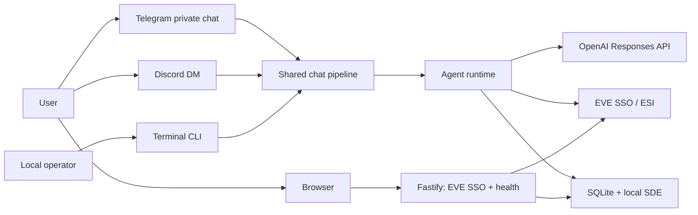

# EVE Agent Threat Model

Last verified: 2026-07-14

## Scope

EVE Agent is a single-process, multi-user Node.js application. Telegram private
chats, Discord DMs, and an operator-owned interactive terminal CLI are its
product surfaces. Fastify exposes only the EVE SSO login redirect and callback
plus `GET /health`; there is no web dashboard, browser session, Telegram Login
Widget, or Telegram-to-browser handoff.

This document covers the application boundaries in the current repository. It
does not claim to assess provider internals, host/OS hardening, network
perimeter controls, or a particular operator deployment.

## System and trust boundaries

| Boundary | Data crossing it | Primary controls | Evidence |
| --- | --- | --- | --- |
| Telegram private chat or Discord DM -> chat pipeline | Commands, text, platform identifiers | DM/private-chat restriction, optional allowlist, per-actor rate limit, one active request per lane, global in-process concurrency cap | `src/telegram/`, `src/discord/`, `src/chat/shared.ts` |
| Local terminal -> CLI lane and shared chat pipeline | Operator text, asynchronous feed alerts, `chat_id = 0` | Local host access, terminal-control/secret sanitization, serialized prompt-aware output, feed-only notification capability | `src/cli/`, `src/messaging/outbound.ts`, `src/agent/tools.ts` |
| Browser -> Fastify | One-time SSO state; EVE callback code and state | State lookup and one-time consumption, short redirect link, cache-control on login redirect, CSP/anti-framing/referrer headers | `src/web/auth-routes.ts`, `src/auth/auth-request.ts`, `src/web/security.ts` |
| Fastify -> EVE SSO | Authorization code and client credentials | Exact configured callback URL, HTTPS transport, JWT verification, encrypted token storage | `src/web/auth-routes.ts`, `src/eve/sso-auth.ts`, `src/auth/secret-storage.ts` |
| Agent runtime -> OpenAI | User text, SQLite chat context, profile data, tool inputs/outputs | Official Responses API endpoint only, `store=false`, stateless continuation, no secrets in prompts, HMAC-derived safety identifier when configured | `src/config.ts`, `src/agent/native-responses.ts`, `src/agent/prompts.ts` |
| Agent runtime -> ESI / local SDE | Public and user-linked private EVE data | Capability gate before stale private ESI access, encrypted token persistence, user/chat ownership checks, bounded retries and pagination | `src/eve/`, `src/agent/executor.ts` |
| Runtime -> SQLite and local profile artifacts | Tokens, conversation history, auth state, `USER.md` profile data | Application-level token encryption, opaque state values, atomic profile writes, host filesystem permissions | `src/db/`, `src/auth/secret-storage.ts`, `src/eve/user-profile-storage.ts` |
| Bot or CLI process -> DB-backed runtime | Feed cursor, route monitors, platform outbound lane | One atomic DB-adjacent process lock; only one app/CLI process may own a DB at a time | `src/runtime/process-lock.ts`, `src/app.ts`, `src/cli/chat.ts` |
| Direct version command -> canonical GitHub release API | Installed version and public stable release metadata | Fixed endpoint, no credentials, timeout/body cap, strict tag/URL validation, remote body discarded, shared cache | `src/update/` |

## Assets

| Asset | Security objective |
| --- | --- |
| EVE access and refresh tokens | Confidentiality and integrity |
| Character-to-user and chat-lane links | Confidentiality and integrity |
| One-time EVE SSO state | Integrity and replay resistance |
| Conversation history, summaries, and profile artifacts | Confidentiality and integrity |
| OpenAI quota and ESI capacity | Availability |
| Tool policy and prompt integrity | Integrity |

## Entry points

| Surface | Reachability | Notes |
| --- | --- | --- |
| Telegram messages, commands, and callback queries | Telegram private chats | Primary bot ingress. |
| Discord DM messages | Discord DMs only | Shares the chat runtime; guild messages are ignored. |
| Discord slash commands | Discord guilds and DMs | Commands are registered in available contexts; a non-DM invocation is rejected ephemerally before identity resolution or agent execution. |
| Interactive terminal CLI | Local host session | Uses the explicit zero chat lane; route/watch alerts run only while the CLI owns the database lock. |
| `GET /auth/eve/login?state=…` | Browser link supplied by a bot | Validates unconsumed state then redirects to the EVE authorization URL. |
| `GET /auth/eve/callback` and compatibility alias `GET /callback` | EVE SSO redirect | Consumes state, exchanges code, verifies identity, and links a character. |
| `GET /health` | Operator/browser | Reports process health; it is not an authenticated management API. |
| `/version`, `/update`, `npm run update:check` | Allowed chat users or local operator | Read-only stable-release discovery; no checkout, package, supervisor, or restart capability. |

## Highest-value threat paths

| ID | Scenario and impact | Current controls | Residual risk / review focus |
| --- | --- | --- | --- |
| TM-01 | A public Telegram or Discord user sends costly requests until OpenAI quota, ESI limits, or the single process is saturated. | Optional platform allowlists; private/DM-only ingress; per-actor request window; per-lane in-flight rejection; global active-request cap; bounded model/tool loops. | Limits are process-local and default-open when allowlists are unset. Operators should set allowlists for private deployments and monitor quota/errors. |
| TM-02 | A bug in identity or lane ownership lets one user access another user's conversation or linked character. | User and chat-lane ownership checks; Discord negative internal chat keys; character links carry owner data; ESI capability checks. | Review all changes to `UserContext`, thread ownership, relinking, and migrations for cross-user access. |
| TM-03 | An attacker replays, substitutes, or steals a bot-delivered EVE SSO login link or callback state. | State is stored and consumed once; expired/used links are rejected before EVE redirect; callback verifies the EVE JWT before persistence. | The link is a bearer value until consumed. Do not put it in operator logs, screenshots, or public chat; keep transport HTTPS in deployment. |
| TM-04 | ESI-derived names, fittings, conversation history, or user prompts try to override agent policy and drive unsafe tool use. | The developer prompt labels profile and summary blocks as data; tools are implemented locally; private data is capability-gated; tool loop limits are bounded. | Prompt isolation is defense in depth, not a trust boundary. Treat new tools and new data inserted into prompts as security-sensitive; add adversarial tests for changes. |
| TM-05 | Host compromise, backup disclosure, or an exposed `.env` reveals encrypted token rows together with the key material or private history. | Token fields are encrypted before SQLite write; opaque auth state is stored; token values are not exposed to the model. | A single process still needs decryption keys. Use a dedicated OS account, restrictive permissions and backups, HTTPS, and a rotation/relink procedure. |
| TM-06 | A configuration or code change routes traffic to a non-official model endpoint or asks the provider to retain conversational state. | Runtime fixes the endpoint to `https://api.openai.com/v1`; `OPENAI_RESPONSE_STATE_MODE=server` is rejected; Responses calls use `store=false`. | Review all provider/config changes against `docs/openai-integration.md`; do not add compatibility providers or retained-state paths without an explicit policy decision. |
| TM-07 | A chat user or compromised model attempts to turn update checking into host-level code execution. | Update commands bypass the model, validate only public metadata, and expose no apply/restart path; model-facing code retains no shell access. | Future automation requires a separate local operator/supervisor design with immutable staging, migration-aware rollback, and explicit authorization review. |

## Security review checklist

- Confirm at least one bot token is configured and each enabled platform has the intended allowlist policy.
- Check that only `/auth/eve/login`, `/auth/eve/callback`, `/callback`, and `/health` are registered by Fastify.
- Test expired, reused, missing, and mismatched EVE SSO state without logging secrets.
- Test cross-user and cross-platform ownership boundaries for threads and private ESI access.
- Test prompt-injection resistance for profile data and tool descriptions whenever those surfaces change.
- Verify production logs redact secrets and that backups, `.env`, SQLite, and `USER.md` artifacts are not broadly readable.
- Run `npm run check` after changes affecting these boundaries.

## Source map

- Bot ingress: `src/telegram/`, `src/discord/`, `src/chat/shared.ts`
- Terminal ingress and output: `src/cli/`, `src/messaging/outbound.ts`
- Browser routes: `src/web/server.ts`, `src/web/auth-routes.ts`, `src/web/health.ts`, `src/web/security.ts`
- EVE identity and tokens: `src/auth/`, `src/eve/sso.ts`, `src/eve/sso-auth.ts`, `src/eve/capabilities.ts`
- Agent/provider boundary: `src/agent/`, `src/config.ts`
- Persistence: `src/db/`, `src/eve/user-profile-storage.ts`
- Runtime ownership: `src/runtime/process-lock.ts`

Related operational policy: [docs/SECURITY.md](./docs/SECURITY.md) and [docs/openai-integration.md](./docs/openai-integration.md).
